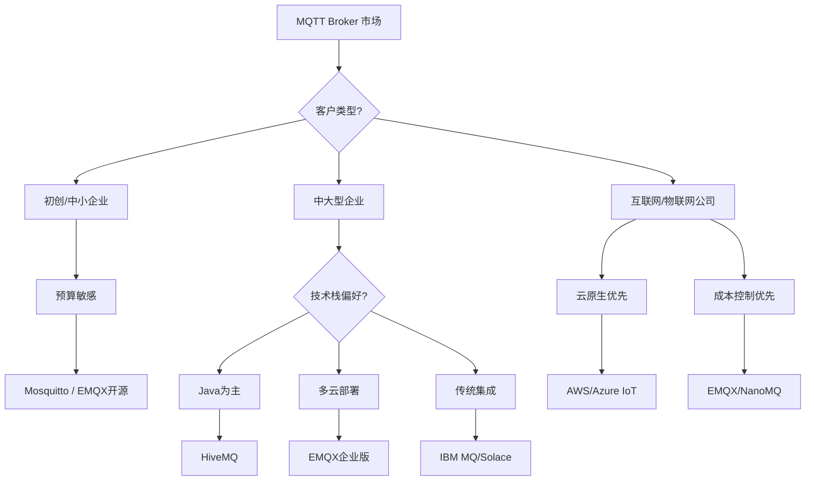

## EMQX 竞品全景分析

### **竞品分类图谱**

```
EMQX 竞品生态圈：
┌─────────────────────────────────────────────────────┐
│                   MQTT Broker 市场                   │
├─────────────────────────────────────────────────────┤
│ 开源阵营        │ 商业阵营        │ 云服务阵营        │
├─────────────────┼─────────────────┼──────────────────┤
│ • Mosquitto     │ • HiveMQ        │ • AWS IoT Core   │
│ • NanoMQ        │ • VerneMQ       │ • Azure IoT Hub  │
│ • Eclipse Mosca │ • IBM MQ        │ • Google Cloud   │
│ • EMQX 开源版   │ • Solace        │ • Alibaba Cloud  │
│ • RabbitMQ      │ • TIBCO         │ • Tencent Cloud  │
│ • ActiveMQ      │ • Software AG   │ • EMQX Cloud     │
│ • vernemq       │                 │                  │
└─────────────────┴─────────────────┴──────────────────┘
```

---

## **主要竞品深度对比**

### **1. 开源竞品（免费/社区版）**

#### **A. Mosquitto (Eclipse)**
```yaml
技术栈: C语言
定位: "轻量级标准实现"
许可证: EPL/EDL
成熟度: ⭐⭐⭐⭐⭐ (最成熟)

优点:
  - 官方参考实现，标准兼容性最好
  - 极低资源占用 (内存<10MB)
  - 稳定可靠，部署简单
  - 内置MQTT-SN支持

缺点:
  - 功能单一，无规则引擎
  - 集群支持弱 (需外部工具)
  - 扩展性有限
  - 无官方Dashboard

适用场景: 小型部署，标准合规性要求高
```

#### **B. NanoMQ**
```yaml
技术栈: C/Nanomsg NNG
定位: "边缘计算专用"
许可证: MIT
成熟度: ⭐⭐⭐ (新兴)

优点:
  - 专门为边缘优化
  - 极高性能 (微秒级延迟)
  - 支持多协议 (MQTT, WebSocket, nanomsg)
  - 零依赖部署

缺点:
  - 功能有限
  - 社区较小
  - 文档不够完善
  - 企业功能缺失

适用场景: 边缘网关，资源受限环境
```

#### **C. HiveMQ Community Edition**
```yaml
技术栈: Java
定位: "功能丰富的开源版"
许可证: Apache 2.0
成熟度: ⭐⭐⭐⭐

优点:
  - 功能完整 (接近企业版)
  - 优秀的管理界面
  - 良好的文档和社区
  - 支持MQTT 5.0所有特性

缺点:
  - Java内存占用大
  - 集群节点限制 (25节点)
  - 企业功能需付费
  - 相对较重

适用场景: 中型项目，需要良好管理界面
```

#### **D. VerneMQ**
```yaml
技术栈: Erlang/OTP
定位: "高性能集群"
许可证: Apache 2.0 (开源) + 商业
成熟度: ⭐⭐⭐⭐

优点:
  - 强大的集群能力
  - 水平扩展性好
  - 支持多租户
  - 插件系统灵活

缺点:
  - 学习曲线陡 (Erlang)
  - 社区相对较小
  - 中文支持有限
  - 管理工具较弱

适用场景: 大规模集群，多租户需求
```

### **2. 商业竞品（企业付费）**

#### **A. HiveMQ Enterprise**
```yaml
定价: 按连接数/年 ($0.5-2/设备/年)
定位: "企业级全功能方案"

核心优势:
  ✅ 最完整的MQTT 5.0支持
  ✅ 优秀的安全特性 (TLS 1.3)
  ✅ 强大的扩展插件
  ✅ 专业的技术支持
  ✅ 行业合规认证 (ISO, SOC2)

vs EMQX:
  价格: HiveMQ 更贵
  性能: 相当
  功能: HiveMQ 插件生态更丰富
  支持: 同等水平
```

#### **B. Solace PubSub+**
```yaml
定价: 定制 (通常 $50k+/年)
定位: "企业消息中间件巨头"

核心优势:
  ✅ 支持30+消息协议 (MQTT, AMQP, JMS, REST...)
  ✅ 超大规模 (百万级连接)
  ✅ 事件网格架构
  ✅ 硬件加速选项

独特功能:
  - 动态消息路由
  - 主题层次自动优化
  - 消息重播
  - 多数据中心同步

vs EMQX:
  定位: Solace 更高端 (金融/电信级)
  价格: Solace 贵3-10倍
  协议: Solace 支持更广泛
```

#### **C. IBM MQ (传统巨头)**
```yaml
定价: 按CPU核心/年 ($10k+/核心/年)
定位: "传统企业消息中间件"

核心优势:
  ✅ 数十年企业验证
  ✅ 超强可靠性
  ✅ 完整的事务支持
  ✅ 丰富的企业集成

缺点:
  - 架构传统
  - 资源消耗大
  - 现代化特性少
  - 价格昂贵

vs EMQX:
  现代化程度: EMQX 领先
  价格: IBM MQ 贵5-20倍
  可靠性: IBM MQ 略有优势
```

#### **D. AWS IoT Core / Azure IoT Hub**
```yaml
定价: 按消息数/连接时间
定位: "云原生托管服务"

核心优势:
  ✅ 零运维
  ✅ 无缝集成云服务
  ✅ 自动扩展
  ✅ 安全合规 (云厂商背书)

劣势:
  - 厂商锁定
  - 成本随规模指数增长
  - 定制化受限
  - 网络延迟 (公共云)

vs EMQX Cloud:
  功能: 相当
  价格: 云厂商更贵 (长期)
  集成: 各有优势
```

---

## **详细对比表格**

### **技术特性对比**
| 特性 | EMQX | Mosquitto | HiveMQ | VerneMQ | AWS IoT Core |
|------|------|-----------|---------|----------|--------------|
| **MQTT 5.0** | ✅ 完整 | ✅ 完整 | ✅ 完整 | ✅ 完整 | ✅ 完整 |
| **集群支持** | ✅ 强 | 🔶 弱 | ✅ 强 | ✅ 强 | ✅ 托管 |
| **规则引擎** | ✅ SQL式 | ❌ 无 | ✅ 插件 | 🔶 基础 | ✅ 有限 |
| **数据桥接** | ✅ 30+ | ❌ 无 | ✅ 50+ | ✅ 10+ | ✅ 云服务 |
| **Web管理** | ✅ 完整 | ❌ 无 | ✅ 优秀 | 🔶 基础 | ✅ AWS控制台 |
| **多协议** | ✅ MQTT/CoAP | ✅ MQTT-SN | ✅ 扩展 | ✅ 扩展 | ✅ 有限 |
| **性能** | ⭐⭐⭐⭐ | ⭐⭐⭐ | ⭐⭐⭐⭐ | ⭐⭐⭐⭐ | ⭐⭐⭐⭐ |
| **学习曲线** | 中等 | 简单 | 中等 | 较难 | 简单 |

### **成本对比 (10k设备场景)**
```bash
# 第一年总拥有成本估算
EMQX 企业版:      $15,000 - $30,000
HiveMQ 企业版:    $30,000 - $60,000
AWS IoT Core:     $40,000 - $80,000 (消息密集)
Mosquitto 自建:   $50,000+ (人力+运维)
Solace PubSub+:   $100,000+
IBM MQ:          $200,000+
```

### **生态系统对比**
```
插件/扩展生态：
┌─────────────┬─────────────────────────────────────┐
│ 产品        │ 扩展能力                            │
├─────────────┼─────────────────────────────────────┤
│ EMQX        │ 插件 (Erlang/Java/Python)           │
│ HiveMQ      │ 最强插件生态 (Java)                 │
│ VerneMQ     │ Erlang插件，学习曲线高              │
│ Mosquitto   │ 功能固定，基本无扩展                │
│ Solace      │ REST API + SDK                      │
│ 云服务      │ 厂商生态系统                        │
└─────────────┴─────────────────────────────────────┘
```

---

## **市场定位分析**

### **按目标客户划分**


### **按应用场景划分**
```rust
enum ApplicationScenario {
    // EMQX 优势场景
    HybridIoTDeployment,      // 混合物联网部署
    EdgeComputing,            // 边缘计算
    RealTimeAnalytics,        // 实时分析
    
    // HiveMQ 优势场景
    FinancialServices,        // 金融服务
    Automotive,               // 汽车行业
    EnterpriseIntegration,    // 企业集成
    
    // Mosquitto 优势场景
    EmbeddedSystems,          // 嵌入式系统
    LegacySystemUpgrade,      // 遗留系统升级
    StandardCompliance,       // 标准合规要求
    
    // 云服务优势场景
    FastTimeToMarket,         // 快速上市
    LimitedOpsTeam,           // 运维团队有限
    CloudNativeArchitecture,  // 云原生架构
}
```

---

## **行业采用情况**

### **各产品典型客户**
```
EMQX:
  • 华为 (OceanConnect IoT平台)
  • 中国移动
  • 国家电网
  • 蔚来汽车
  
HiveMQ:
  • 宝马
  • 奥迪
  • 博世
  • 大众汽车
  
Solace:
  • 摩根大通
  • 高盛
  • 纳斯达克
  • 伦敦交易所
  
Mosquitto:
  • 各类中小项目
  • 嵌入式设备厂商
  • 教育机构
  
AWS IoT Core:
  • 初创公司
  • 互联网企业
  • 全球化业务
```

### **市场份额估算 (2024)**
```bash
全球 MQTT Broker 市场份额：
1. AWS IoT Core:      ~35% (云托管)
2. EMQX:              ~20% (开源+商业)
3. Mosquitto:         ~15% (轻量级)
4. HiveMQ:            ~12% (汽车行业)
5. Azure IoT Hub:     ~8% (微软生态)
6. 其他:              ~10% (VerneMQ, NanoMQ等)

中国市场：
1. EMQX:              ~40%
2. 阿里云 IoT:        ~25%
3. 腾讯云 IoT:        ~20%
4. 其他:              ~15%
```

---

## **技术趋势分析**

### **关键差异化趋势**
```
2024-2025 MQTT 市场趋势：
1. 边缘计算融合: NanoMQ/EMQX Edge 增长快
2. AI 集成: 规则引擎 + AI 模型推理
3. 多云部署: Broker 的跨云管理能力
4. 协议融合: MQTT + Kafka + HTTP/3
5. 安全增强: 国密算法、零信任架构
6. 低代码: 可视化规则配置
```

### **各产品的战略方向**
```yaml
EMQX:
  重点: 边缘-云协同，多协议网关
  路线图: 
    - 更轻量的边缘版本
    - AI规则引擎集成
    - 5G网络优化

HiveMQ:
  重点: 汽车和工业4.0
  路线图:
    - AUTOSAR兼容性
    - 时间敏感网络(TSN)
    - 功能安全认证

云厂商:
  重点: 生态绑定，SaaS化
  路线图:
    - 与AI服务深度集成
    - 无服务器架构
    - 行业解决方案
```

---

## **选择建议矩阵**

### **基于需求的推荐**
| 需求优先级 | 首选 | 次选 | 备注 |
|------------|------|------|------|
| **成本最低** | Mosquitto | EMQX开源 | 预算极度敏感 |
| **功能最全** | HiveMQ企业版 | EMQX企业版 | 需要完整企业功能 |
| **性能最强** | NanoMQ (边缘) | EMQX (中心) | 区分边缘和中心 |
| **云原生** | AWS IoT Core | EMQX Cloud | 不想运维 |
| **传统集成** | IBM MQ | Solace | 已有企业系统 |
| **汽车行业** | HiveMQ | Vector (CANoe) | 行业标准 |
| **快速验证** | EMQX开源 | HiveMQ CE | 快速POC |
| **大规模集群** | VerneMQ | EMQX | >100节点 |

### **基于团队的推荐**
```toml
[team_profile.java]
recommendation = "HiveMQ"
reason = "Java生态熟悉，插件开发方便"

[team_profile.erlang]
recommendation = "EMQX 或 VerneMQ"
reason = "Erlang技术栈匹配"

[team_profile.c_cpp]
recommendation = "Mosquitto 或 NanoMQ"
reason = "C语言背景，追求极致性能"

[team_profile.cloud_devops]
recommendation = "云服务 (AWS/Azure)"
reason = "运维自动化，CI/CD集成"

[team_profile.fullstack]
recommendation = "EMQX"
reason = "平衡功能、性能和易用性"
```

---

## **迁移考虑**

### **从竞品迁移到 EMQX**
```bash
# 迁移难易度评估：
从 Mosquitto → EMQX:   容易 (配置迁移)
从 HiveMQ → EMQX:      中等 (插件重写)
从 AWS IoT Core → EMQX: 困难 (架构重构)
从 IBM MQ → EMQX:      非常困难 (协议差异)

# 推荐迁移策略：
1. 并行运行双系统
2. 流量逐步切分 (10%, 30%, 70%, 100%)
3. 验证功能对等性
4. 性能基准测试对比
```

### **EMQX 的竞争优势**
```
EMQX 的核心优势：
1. 价格性能比: 比HiveMQ便宜，比Mosquitto功能强
2. 本土化优势: 中文文档、本地支持、国密算法
3. 技术平衡: Erlang的高并发 + Rust的性能优化
4. 混合部署: 一套方案覆盖边缘到云
5. 开源友好: 开源版功能相对完整
```

---

## **总结建议**

### **一句话建议：**
- **预算紧张/简单需求** → Mosquitto
- **汽车/金融/要求最高可靠性** → HiveMQ/Solace
- **混合部署/边缘计算** → EMQX
- **云原生/快速上线** → 云厂商IoT服务
- **传统企业集成** → IBM MQ/Solace

### **EMQX 的最佳适用场景：**
```
✅ 中国本土企业项目
✅ 边缘-云协同架构
✅ 多协议接入需求
✅ 成本敏感的中大型部署
✅ 需要定制化开发的项目
```

### **最后提醒：**
```
选择 MQTT Broker 的关键因素：
1. 团队技术栈匹配度
2. 总拥有成本 (TCO) 分析
3. 未来3-5年的扩展需求
4. 供应商的长期支持能力
5. 行业合规和认证要求

建议: 
1. 列出具体需求清单
2. 对前3名候选进行POC测试
3. 用实际数据做决策
```

**行动步骤：**
1. 短期：下载2-3个候选产品的社区版测试
2. 中期：联系供应商获取报价和试用版
3. 长期：基于业务增长规划技术路线图